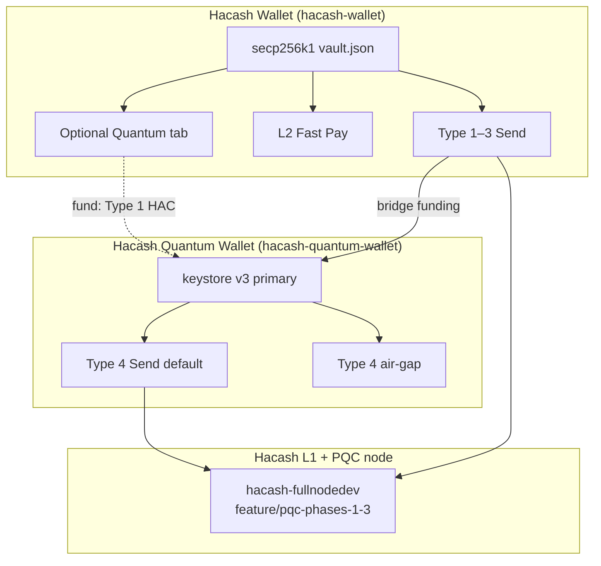
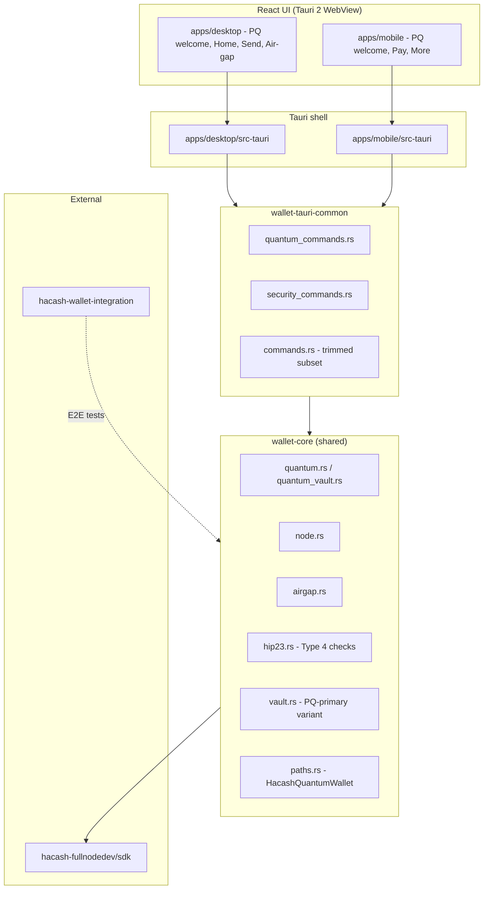
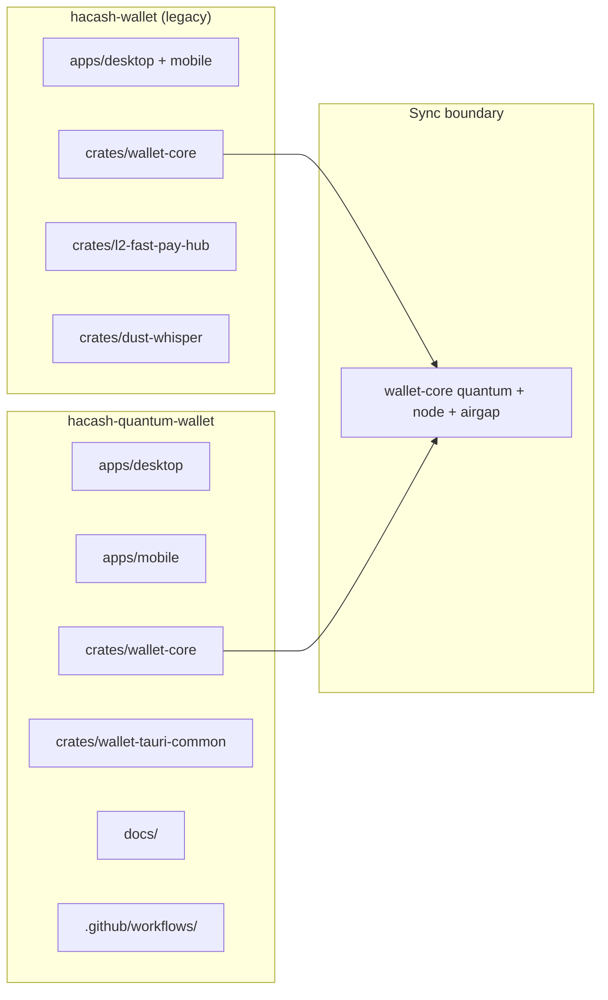
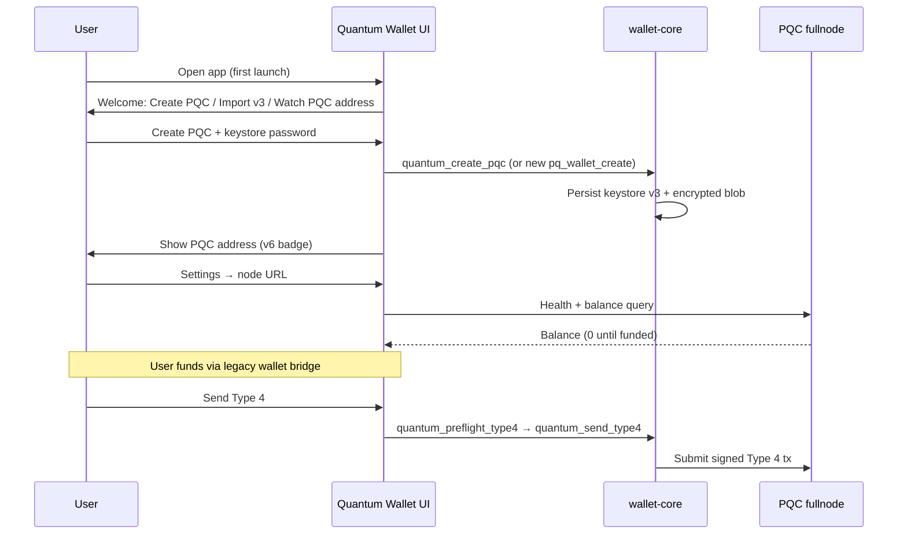
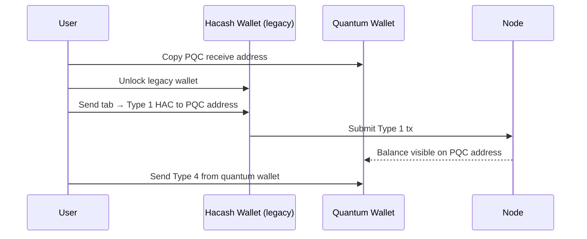
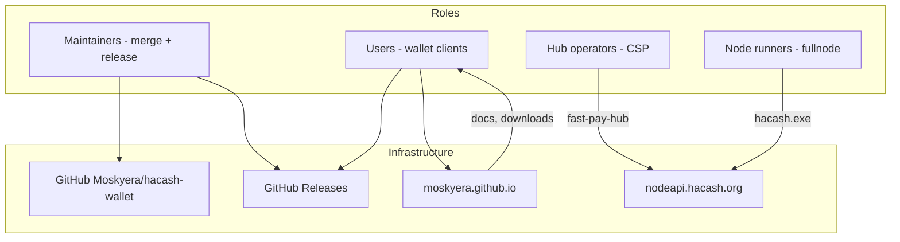
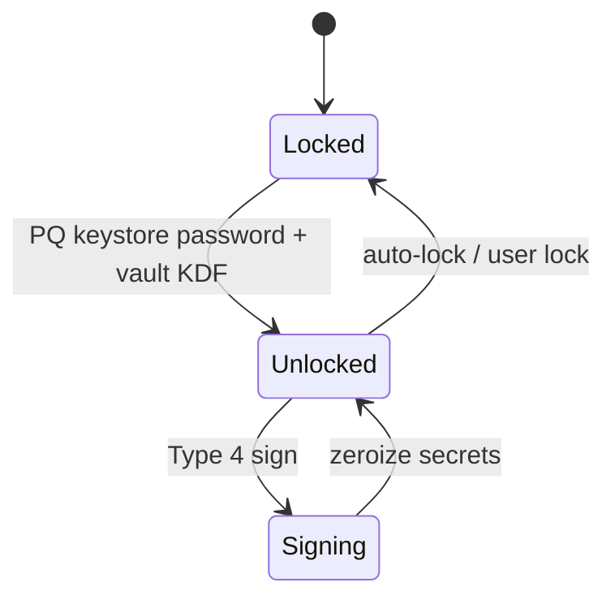
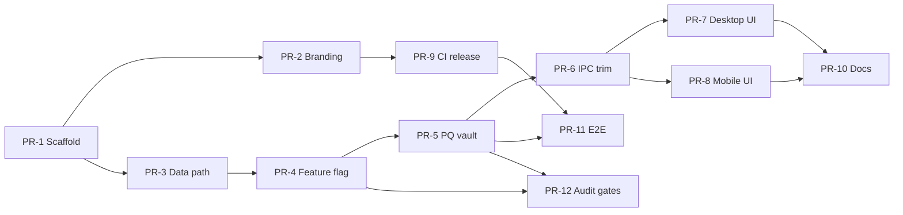

# Hacash Quantum Wallet - Product Design & Fork Plan

| Field | Value |
|-------|-------|
| **Document ID** | `DESIGN-HQW-001` |
| **Status** | Draft - Phase 0 (design only; implementation deferred) |
| **Author** | Systems architecture (derived from `moskyera-quantum-wallet` codebase audit) |
| **Date** | 2026-07-12 |
| **Source repo** | [Moskyera/hacash-wallet](https://github.com/Moskyera/hacash-wallet) (`C:\Users\KQHEX\Documents\moskyera-quantum-wallet`) |
| **Target repo** | `Moskyera/hacash-quantum-wallet` (new; not yet created) |
| **Audience** | Senior engineers, community operators, release maintainers |
| **Related** | `docs/HUB-OPERATOR.md`, `README.md`, `releases/README.md` |

---

## 1. Overview

**Hacash Quantum Wallet** (`hacash-quantum-wallet`) is a **separate product** forked from the existing **Hacash Wallet** (`hacash-wallet`). It is **post-quantum-first (PQ-first)**: from the welcome screen onward, the primary identity is a **PQC v6 (ML-DSA-65)** or **Hybrid v7** account backed by **keystore v3**, with **Type 4** on-chain sends as the default payment rail.

The **current Hacash Wallet remains unchanged** as the stable, community-operable legacy product (secp256k1 Types 1–3, L2 Fast Pay, optional Quantum tab). Active engineering continues on the legacy wallet; the quantum fork is **designed and planned now**, with implementation deferred until community handoff and legacy milestones are met.

### 1.1 Background

The existing monorepo already contains a production-grade quantum subsystem:

| Capability | Location | Notes |
|------------|----------|-------|
| PQC / Hybrid account creation | `crates/wallet-core/src/quantum.rs` | SDK: `create_pqc_account_keystore`, `create_hybrid_account_keystore` |
| Encrypted quantum keystore at rest | `crates/wallet-core/src/quantum_vault.rs` | `quantum.keystore.enc`, Argon2id + AES-256-GCM |
| Type 4 send + preflight | `crates/wallet-core/src/quantum.rs`, `type4_fee.rs` | Dynamic fee via node `/query/fee/average` |
| Shared Tauri IPC | `crates/wallet-tauri-common/src/quantum_commands.rs` | 15+ `quantum_*` commands |
| Desktop Quantum tab | `apps/desktop/src/App.tsx`, `components/SendQuantumTx.tsx`, `QuantumFundingCard.tsx` | Optional; requires legacy unlock first |
| Mobile Quantum screen | `apps/mobile/src/components/QuantumScreen.tsx` | More → Quantum |
| Type 4 air-gap | `crates/wallet-core/src/airgap.rs` | `tx_type: 4` envelope |
| Audit gates | `crates/wallet-core/tests/audit_quantum_smoke.rs` | PQC/Hybrid lifecycle |
| E2E funding pattern | `crates/wallet-core/examples/e2e_fund_quantum.rs` | Legacy Type 1 → quantum address → Type 4 |

**Constraint today:** quantum features are **secondary** to the legacy secp256k1 vault (`crates/wallet-core/src/vault.rs`). Unlock flow in `wallet.rs` derives `QuantumFileKey` from the **legacy vault passphrase** and loads `quantum.keystore.enc`. Funding requires a **legacy Send** (Type 1 HAC) to the quantum address (`QuantumFundingCard.tsx`).

**Node dependency:** PQC Type 4 requires sibling `hacash-fullnodedev` on branch `feature/pqc-phases-1-3` (cloned in CI: `.github/workflows/ci.yml`).

### 1.2 Goals

1. **Separate PQ-first product** - new repo `hacash-quantum-wallet`, distinct branding, package IDs, data directory, and release tags.
2. **Preserve legacy wallet** - no dual-mode UX in one app; legacy repo stays stable and community-operable.
3. **Reuse proven crypto stack** - `wallet-core` quantum modules, `wallet-tauri-common/quantum_commands.rs`, keystore v3, Type 4 pipeline.
4. **Clear bridge path** - documented funding flow from legacy wallet → quantum address (existing pattern).
5. **Fork plan ready** - step-by-step scaffold, PR sequence, rollout phases; implementation deferred.
6. **Community handoff** - legacy wallet released to community with hub/node/release/docs governance.

### 1.3 Non-Goals (Phase 0–2)

- Replacing or migrating legacy users in-place within `hacash-wallet`.
- Dual-mode single app (legacy + PQ tabs in one binary).
- L2 Fast Pay as primary rail in quantum fork (deferred; may add PQ-aware hub later).
- Publishing `wallet-core` to crates.io in Phase 0 (evaluate in Phase 1).
- Mainnet PQC network activation policy (wallet follows node/HIP availability).
- iOS App Store release in initial quantum fork (Android + desktop first).

---

## 2. Proposed Design

### 2.1 Product relationship



**Bridge funding (legacy → quantum):** unchanged on-chain mechanics - send **Type 1 HAC** from legacy address to PQC/Hybrid address. Credits the same balance used for Type 4. Documented in `QuantumFundingCard.tsx` and `e2e_fund_quantum.rs`.

### 2.2 Architecture (quantum fork target)



### 2.3 Repository structure (target)



**Fork copy (initial):**

| Path | Action |
|------|--------|
| `apps/desktop/` | Copy; strip legacy nav, PQ-first `App.tsx` |
| `apps/mobile/` | Copy; PQ-first `WelcomeScreen`, demote Fast Pay |
| `crates/wallet-core/` | Copy; add `product` feature flag |
| `crates/wallet-tauri-common/` | Copy; register trimmed command set |
| `crates/l2-fast-pay-hub/` | **Omit** from quantum fork v1 |
| `crates/dust-whisper/` | **Omit** from quantum fork v1 |
| `.github/workflows/` | Copy; retag `v*-quantum-desktop` / `v*-quantum-mobile` |
| `docs/HUB-OPERATOR.md` | **Do not copy** (legacy CSP operators) |
| `scripts/START-DEV-STACK.bat` | Adapt for PQC node only |

### 2.4 User flows

#### 2.4.1 PQ-first onboarding (quantum fork)



#### 2.4.2 Bridge funding (cross-product)



#### 2.4.3 Hybrid migration (optional v7)

Users with existing secp256k1 keys use **Hybrid v7** at quantum welcome (import legacy privkey hex or link during create - `quantum_create_hybrid` in `quantum_commands.rs`). Pure PQC v6 remains the recommended default for new PQ-only users.

### 2.5 Data isolation

| Setting | Legacy (`hacash-wallet`) | Quantum (`hacash-quantum-wallet`) |
|---------|--------------------------|-----------------------------------|
| Default data dir | `%APPDATA%\HacashWallet` (`paths.rs`) | `%APPDATA%\HacashQuantumWallet` |
| Env override | `HACASH_WALLET_DATA` | `HACASH_QUANTUM_WALLET_DATA` |
| Vault file | `vault.json` (secp256k1) | `pq-vault.json` or keystore-primary layout |
| Quantum keystore | `quantum.keystore.enc` (secondary) | Primary identity file |
| Settings | `settings.json` incl. `quantum_mode` | `settings.json` - no `quantum_mode` flag (always PQ) |
| History | `tx_history.json` | `tx_history.json` (Type 4 focused) |

**Rationale:** side-by-side install on desktop/mobile without overwriting legacy funds or settings.

### 2.6 Branding & package identifiers

| Asset | Legacy | Quantum fork |
|-------|--------|--------------|
| Product name | Hacash Wallet | Hacash Quantum Wallet |
| Desktop `productName` | `Hacash Wallet` (`apps/desktop/src-tauri/tauri.conf.json`) | `Hacash Quantum Wallet` |
| Desktop identifier | `org.hacash.wallet` | `org.hacash.quantum.wallet` |
| Mobile identifier | `org.hacash.wallet.mobile` | `org.hacash.quantum.wallet.mobile` |
| Deep link schemes | `hacash://`, `hacd://` | `hacash-q://`, `hacashquantum://` |
| npm package names | `hacash-wallet-desktop`, `hacash-wallet-mobile` | `hacash-quantum-desktop`, `hacash-quantum-mobile` |
| Rust binaries | `hacash-wallet`, `hacash-wallet-mobile` | `hacash-quantum-wallet`, `hacash-quantum-mobile` |
| User-Agent | `HacashWalletMobile/0.1.x` (`node.rs`) | `HacashQuantumWallet/0.1.x` |
| Release tags | `v0.1.12-desktop`, `v0.1.15-mobile` | `v0.1.0-quantum-desktop`, `v0.1.0-quantum-mobile` |

### 2.7 Desktop scope (quantum fork)

| Screen | Legacy desktop | Quantum desktop |
|--------|----------------|-----------------|
| Welcome | Create/import **secp256k1** seed | Create/import **PQC v3** / watch PQC |
| Home | HAC + HACD + BTC | HAC on PQC address |
| Send | Type 1–3, Fast Pay routing | **Type 4 only** (primary) |
| Fast Pay | Full tab (`fastpay` in `App.tsx` NAV) | **Removed** v1 |
| Quantum | Optional tab | **N/A** (whole app is quantum) |
| HACD / BTC panels | `HacdSendPanel.tsx`, `BtcSendPanel.tsx` | **Removed** v1 |
| Air-gap | L1 + Type 4 | **Type 4 primary**; optional L1 watch-only |
| Advanced / HIP-23 | Type 3 validators | Type 4 / PQ-focused checks |
| Security | WebAuthn ES256, Windows Hello | Same stack where applicable |
| Settings | `quantum_mode` toggle | Node URL, security profile only |

**Files to heavily modify:** `apps/desktop/src/App.tsx` (2400+ lines), remove `NAV_ITEMS` entries for `fastpay`, `send` (legacy), `quantum`; new PQ welcome flow.

**Files to reuse:** `SendQuantumTx.tsx`, `KeystoreV3Modal.tsx`, `AddressBadge.tsx`, `QuantumNodeHealth.tsx`, `quantumMeta.ts`, `quantum.css`.

### 2.8 Mobile scope (quantum fork)

| Area | Legacy mobile | Quantum mobile |
|------|---------------|----------------|
| Welcome | secp256k1 create (`WelcomeScreen.tsx`) | PQC create/import |
| Bottom nav | Home, Pay, Receive, More | Home, Pay, Receive, More (simplified) |
| Pay tab | HAC/HACD/BTC + Fast Pay | Type 4 HAC |
| More → Quantum | `QuantumScreen.tsx` | **Promoted to default Pay/Home** |
| More → Fast Pay | `FastPayChannelScreen.tsx` | **Removed** v1 |
| Messenger / Whisper | Present | **Removed** v1 |
| Biometrics | `@tauri-apps/plugin-biometric` | Retain |
| Deep links | `hacash://` | `hacash-q://` |

---

## 3. Community Handoff Plan (Legacy Hacash Wallet)

The legacy wallet transitions to **community operation** while Moskyera continues completing it as primary active work until handoff criteria are met.

### 3.1 Handoff criteria (recommended gates)

| Gate | Target | Evidence |
|------|--------|----------|
| G1 - Reproducible releases | Desktop Windows/Linux + mobile APK from CI | `.github/workflows/release-desktop.yml`, `releases/README.md` |
| G2 - Operator docs | Hub operators self-serve | `docs/HUB-OPERATOR.md` |
| G3 - Integration tests | External repo green | `hacash-wallet-integration` |
| G4 - Mobile Phase 2 | Send + Fast Pay on device | `README.md` checklist |
| G5 - Security gates | `audit_`, `tier0_`, `stress_` passing | `.github/workflows/ci.yml` |
| G6 - Governance charter | Published | `docs/COMMUNITY-GOVERNANCE.md` (to author at handoff) |

### 3.2 Community operation model



### 3.3 What community operates

| Function | Owner | Documentation |
|----------|-------|---------------|
| **Wallet releases** | Community maintainers | `releases/README.md`, tag conventions `v*-desktop` / `v*-mobile` |
| **CSP hubs** | Independent operators | `docs/HUB-OPERATOR.md`, `crates/l2-fast-pay-hub` |
| **Public fullnode** | Node runners / foundation | `nodeapi.hacash.org` default in `settings.rs` |
| **Issue triage** | Maintainers | GitHub Issues + labels: `bug`, `hub`, `mobile`, `security` |
| **Security disclosures** | Maintainers + Moskyera advisory | `SECURITY.md` (to publish) |
| **Integration CI** | Maintainers | `hacash-wallet-integration` repo |

### 3.4 Release channels (legacy)

| Channel | Tag pattern | Artifacts | Audience |
|---------|-------------|-----------|----------|
| Stable desktop | `vX.Y.Z-desktop` | setup.exe, msi, AppImage, deb | General users |
| Stable mobile | `vX.Y.Z-mobile` | `hacash-wallet-mobile-vX.Y.Z-arm64.apk` | Android |
| CI nightly | `main` branch artifacts | Optional GitHub Actions artifacts | Developers |

### 3.5 Documentation handoff package

Publish on [moskyera.github.io](https://moskyera.github.io/):

1. **User guide** - create wallet, Fast Pay, optional Quantum tab (link to bridge doc).
2. **Operator guide** - excerpt from `docs/HUB-OPERATOR.md`.
3. **Node setup** - `hacash-fullnodedev` build + `scripts/START-DEV-STACK.bat`.
4. **Release playbook** - tag, CI, APK signing (`apps/mobile/create-android-keystore.ps1`).
5. **Governance** - maintainer list, RFC process, veto policy for security releases.

### 3.6 Moskyera role post-handoff

- **Continue active development** on legacy wallet until G1–G5 complete (user decision #3).
- **Advisory** on security-critical PRs for 90 days after handoff.
- **No blocking control** over community releases once maintainers are named.
- **Quantum fork** developed in separate repo without destabilizing legacy `main`.

---

## 4. Fork Plan

### 4.1 When to fork

| Trigger | Rationale |
|---------|-----------|
| **Primary:** Legacy handoff G1+G2+G5 complete | Community can sustain legacy; Moskyera bandwidth shifts |
| **Secondary:** `wallet-core` quantum API stable (v0.4+ legacy release) | Minimize merge churn |
| **Do not fork before:** PQ-primary vault design agreed (§2.5, §5.1) | Avoid rework on unlock model |

**Recommended window:** Q4 2026 - after mobile Phase 2 and first community maintainer release.

### 4.2 Fork procedure (step-by-step)

1. **Create repo** `Moskyera/hacash-quantum-wallet` (empty, MIT license).
2. **Snapshot tag** on legacy: `legacy-pre-fork-YYYY-MM-DD` for traceability.
3. **Copy tree** via `git filter-repo` or manual copy of paths in §2.3 (no `target/`, no `releases/apk-*` inspect dirs).
4. **Rewrite branding** - all `tauri.conf.json`, `package.json`, icons, `WalletLogo.tsx`.
5. **Implement data path split** - `paths.rs` → `HacashQuantumWallet`, mobile `lib.rs` data dir init.
6. **Strip legacy UI** - desktop `App.tsx` nav; mobile `MoreRouter.tsx` pages.
7. **PQ-primary unlock** - new `pq_wallet.rs` or feature-gated `wallet.rs` (see §5.1).
8. **Trim Cargo workspace** - remove `l2-fast-pay-hub`, `dust-whisper` members.
9. **CI green** - clone `hacash-fullnodedev` PQC branch (same as `ci.yml`).
10. **Integration fork** - `hacash-quantum-wallet-integration` or tagged suite in existing integration repo.
11. **First release** - `v0.1.0-quantum-desktop` (internal alpha), then mobile APK.
12. **Publish bridge doc** - cross-link from both READMEs.

### 4.3 What to copy verbatim

- `crates/wallet-core/src/quantum.rs`, `quantum_vault.rs`, `type4_fee.rs`
- `crates/wallet-tauri-common/src/quantum_commands.rs`
- `crates/wallet-core/src/airgap.rs` (Type 4 paths)
- `crates/wallet-core/tests/audit_quantum_smoke.rs`
- Desktop: `SendQuantumTx.tsx`, `KeystoreV3Modal.tsx`, `AddressBadge.tsx`, `QuantumNodeHealth.tsx`
- Mobile: `QuantumScreen.tsx` (as basis for main Pay flow)
- Security: `vault.rs` encryption primitives, `unlock_guard.rs`, `secure_mem.rs`, audit test suites

### 4.4 What to delete or disable

| Component | Path | Action |
|-----------|------|--------|
| L2 Fast Pay UI | `App.tsx` `fastpay`, `FastPayChannelScreen.tsx` | Delete |
| Legacy secp256k1 welcome | `WelcomeScreen.tsx`, `App.tsx` welcome | Replace with PQ welcome |
| `quantum_mode` toggle | `QuantumToggle.tsx`, `settings.quantum_mode` | Delete (always on) |
| Quantum funding card bridge CTA | `QuantumFundingCard.tsx` | Replace with external bridge instructions |
| HACD / BTC send | `HacdSendPanel.tsx`, `BtcSendPanel.tsx`, mobile hooks | Delete v1 |
| Dust Whisper | `whisper_commands.rs`, `WhisperScreen.tsx` | Delete v1 |
| Messenger | `messenger.rs`, `MessengerScreen.tsx` | Delete v1 |
| Hub discovery | `HubDiscoveryPanel.tsx` | Delete v1 |
| `l2-fast-pay-hub` crate | workspace member | Remove |
| Desktop relay | `desktop_relay.rs` | Remove |

### 4.5 Release channels (quantum)

| Channel | Tag | Notes |
|---------|-----|-------|
| Alpha | `v0.1.0-alpha-quantum-desktop` | Internal; requires local PQC node |
| Beta | `v0.2.0-beta-quantum-mobile` | Testnet / limited mainnet |
| Stable | `v1.0.0-quantum-desktop` | Requires mainnet Type 4 availability statement |

Separate GitHub Releases project or prefix in monorepo releases page: `quantum-*` assets distinct from legacy filenames.

---

## 5. Shared Crates Strategy

### 5.1 Problem

Both products need `wallet-core` quantum logic. Duplicating the crate in two repos creates **sync drift** on security fixes.

### 5.2 Recommended approach (phased)

| Phase | Strategy | Pros | Cons |
|-------|----------|------|------|
| **Phase 1 (fork scaffold)** | Full copy of `wallet-core` into quantum repo | Fast fork, no coupling | Manual cherry-pick |
| **Phase 2 (6 months)** | Extract shared sub-crate `wallet-core-quantum` OR git dependency | Single source for PQ | Refactor cost |
| **Phase 3 (mature)** | Published crate `hacash-wallet-core` with features `legacy`, `quantum-only` | Clean API | Release discipline |

### 5.3 Feature-flag design (target `wallet-core`)

```toml
# crates/wallet-core/Cargo.toml (future)
[features]
default = ["legacy"]
legacy = ["dep:l2-fast-pay-hub", "dep:dust-whisper", "fast_pay", "secp_vault"]
quantum-product = ["pq-primary-vault"]  # quantum fork only
```

```rust
// crates/wallet-core/src/paths.rs
pub fn wallet_data_root() -> PathBuf {
    #[cfg(feature = "quantum-product")]
    { /* HacashQuantumWallet */ }
    #[cfg(not(feature = "quantum-product"))]
    { /* HacashWallet */ }
}
```

### 5.4 Git submodule alternative

- Submodule `crates/wallet-core` → `hacash-wallet` repo at pinned tag.
- Quantum repo tracks tags; PRs that touch core go to legacy repo first.
- **Downside:** submodule friction for community contributors; not recommended until Phase 3.

### 5.5 Sync policy

| Change type | Source of truth | Propagation |
|-------------|-----------------|-------------|
| Security fix in `quantum_vault.rs` | Whichever repo discovers issue | Cherry-pick within 72h |
| New SDK from fullnodedev | Both repos bump sibling path / git rev | Coordinated release notes |
| Legacy-only Fast Pay | Legacy repo only | No propagation |
| PQ-primary vault API | Quantum repo first | Backport adapter to legacy Quantum tab if needed |

### 5.6 PQ-primary vault (architectural change)

**Current** (`wallet.rs` lines ~421–441): legacy `unlock()` → derive `QuantumFileKey` from vault salt + passphrase → load `quantum.keystore.enc`.

**Target (quantum product):**



Options (decide in Open Questions):

- **A - Keystore-primary:** App passphrase encrypts keystore v3 directly; no secp256k1 `vault.json`.
- **B - Wrapper vault:** Empty secp256k1 stub removed; `pq-vault.json` wraps keystore v3 (reuse Argon2id/AES-GCM from `vault.rs`).
- **C - Dual unlock (transitional):** Import legacy wallet + quantum keystore for Hybrid users only.

**Recommendation:** **Option B** - maximizes reuse of `vault.rs`, `quantum_vault.rs`, audit tests; clearest break from legacy identity.

---

## 6. Security Considerations

| Topic | Legacy behavior | Quantum fork requirements |
|-------|-----------------|---------------------------|
| Key material | secp256k1 in vault; PQ in encrypted sidecar | PQ keys only in memory when unlocked; `zeroize` |
| Keystore export | Keystore v3 JSON + password | Same; prominent backup on create |
| Unlock backoff | `unlock_guard.rs` exponential | Retain |
| Signing policy | WebAuthn / biometric gates on send | Retain for Type 4 (`maybeWebAuthnGate`) |
| File permissions | `secure_write` 0o600 | Retain; new data root |
| Clipboard | Privacy clear timeout | Retain |
| Air-gap | QR envelope `tx_type: 4` | Primary cold path; audit Type 4 QR parsing |
| Node trust | User-configured URL; default `nodeapi.hacash.org` | Require PQC-capable node; health panel mandatory |
| Side-by-side install | N/A | Distinct bundle IDs prevent WebView cache collision |
| Supply chain | `hacash-fullnodedev` sibling path | Pin commit SHA in `Cargo.toml` metadata / `fullnode.lock.json` |
| Hybrid legacy key | Optional privkey hex in UI | Warn: hex in clipboard; prefer air-gap import |

**Threat model delta:** quantum fork removes Fast Pay hub co-sign attack surface; adds ML-DSA side-channel reliance on SDK/node implementation (inherit from fullnodedev).

**Test gates (must pass before quantum alpha):**

```bash
cargo test -p hacash-wallet-core audit_quantum_ -- --test-threads=1
cargo test -p hacash-wallet-core audit_ -- --test-threads=1
cargo test -p hacash-wallet-core tier0_ -- --test-threads=1
```

---

## 7. Rollout Phases

| Phase | Name | Deliverables | Owner |
|-------|------|--------------|-------|
| **0** | Design (now) | This document, summary, stakeholder sign-off | Architecture |
| **1** | Fork scaffold | Empty quantum repo, branding, CI, data path, PQ welcome stub | Moskyera |
| **2** | PQ-default UX | Desktop + mobile send Type 4; remove legacy nav | Moskyera |
| **3** | PQ-primary vault | Option B vault; migration import from keystore v3 | Moskyera |
| **4** | Bridge & docs | Cross-wallet funding guide, moskyera.github.io quantum section | Moskyera + community |
| **5** | Alpha release | `v0.1.0-quantum-desktop` + PQC node pairing guide | Moskyera |
| **6** | Mobile alpha | Signed APK `hacash-quantum-mobile` | Moskyera |
| **7** | Community parallel | Legacy handoff complete; both products independently released | Community + Moskyera |
| **8** | Beta / stable | Mainnet Type 4 readiness statement, `v1.0.0-quantum` | Joint |

**Implementation deferred** until Phase 0 approved and legacy G1–G3 met.

---

## 8. Risks and Mitigations

| Risk | Impact | Likelihood | Mitigation |
|------|--------|------------|------------|
| `wallet-core` drift between repos | Security regression | High | Phase 2 shared crate; sync SLA 72h |
| PQ-primary vault rework | Fork delay | Medium | Decide Option B in Phase 0; spike in Phase 1 PR 3 |
| PQC node not on mainnet | Users cannot send Type 4 | Medium | Node health gating; clear error in `QuantumNodeHealth.tsx` |
| User confusion (two apps) | Wrong app for funding | High | Bridge doc; distinct icons; legacy Quantum tab links to quantum app |
| Hybrid privkey entry | Key leakage | Medium | Deprecate hex paste; QR import only in v1.1 |
| Android package conflict | Install failure | Low | Unique `org.hacash.quantum.wallet.mobile` |
| Community handoff too early | Unmaintained legacy | Medium | Gates G1–G6; Moskyera advisory period |
| fullnodedev branch merge | Breaking SDK API | Medium | Pin SHA; integration tests on bump |

---

## 9. Alternatives Considered

| Alternative | Description | Rejected because |
|-------------|-------------|------------------|
| **Dual-mode single app** | `quantum_mode` toggle + unified nav | User decision: separate product; reduces legacy stability risk |
| **In-place migration** | Force all users to PQ keystore | Breaks community legacy ops; high support burden |
| **Quantum-only desktop, legacy mobile** | Split platform strategy | Inconsistent UX; mobile already has `QuantumScreen.tsx` |
| **Rewrite from scratch** | New Rust/UI stack | Discards audit gates, `tier0_` tests, proven Type 4 path |
| **Submodule-only monorepo** | Two apps in one repo | Still dual-product confusion in releases; user wants separate repo |
| **Keep quantum in legacy only** | No fork | Cannot optimize PQ-first UX (welcome, funding, nav) |

---

## 10. Open Questions

| ID | Question | Decision needed by |
|----|----------|-------------------|
| OQ-1 | PQ-primary vault: Option A, B, or C? | Phase 1 PR 3 |
| OQ-2 | Include Hybrid v7 in v1 quantum fork or PQC-only? | Phase 2 UX |
| OQ-3 | Watch-only PQC address without keystore? | Phase 2 |
| OQ-4 | Separate `hacash-quantum-wallet-integration` repo? | Phase 1 |
| OQ-5 | Public PQC node URL (vs local-only alpha)? | Phase 5 |
| OQ-6 | Re-add L2 Fast Pay with PQ accounts later? | Post-v1 roadmap |
| OQ-7 | crates.io publish timeline for `wallet-core`? | Phase 3 |
| OQ-8 | Community maintainer roster and RFC repo? | Handoff G6 |
| OQ-9 | Icon / visual identity for quantum product? | Phase 1 PR 2 |
| OQ-10 | iOS quantum fork priority vs Android? | Phase 6 |

---

## 11. References

| Resource | URL / path |
|----------|------------|
| Legacy wallet repo | https://github.com/Moskyera/hacash-wallet |
| Community site | https://moskyera.github.io/ |
| Fullnode (PQC branch) | `git clone --branch feature/pqc-phases-1-3 https://github.com/Moskyera/fullnodedev.git` |
| Hub operator guide | `docs/HUB-OPERATOR.md` |
| Integration tests | `../hacash-wallet-integration` (per README) |
| Audit traceability | `../hacash-wallet-integration/AUDIT.md` |
| Desktop Tauri config | `apps/desktop/src-tauri/tauri.conf.json` |
| Mobile Tauri config | `apps/mobile/src-tauri/tauri.conf.json` |
| Quantum IPC | `crates/wallet-tauri-common/src/quantum_commands.rs` |
| Release index | `releases/README.md` |
| Dev stack script | `scripts/START-DEV-STACK.bat` |

---

## 12. Key Decisions

| # | Decision | Rationale |
|---|----------|-----------|
| KD-1 | **Separate product, separate repo** (`hacash-quantum-wallet`) | User mandate; isolates release risk; PQ-first UX without legacy nav debt |
| KD-2 | **Keep legacy wallet as-is** in `hacash-wallet` | Stable community surface; secp256k1 + Fast Pay unchanged |
| KD-3 | **Community handoff for legacy** | Decentralized hub/node operation; Moskyera focuses on completion then advisory |
| KD-4 | **Continue legacy as primary active work** | Quantum fork is design-only until legacy gates met |
| KD-5 | **Implementation deferred** | This document + PR plan only in Phase 0 |
| KD-6 | **Reuse `wallet-core` quantum modules** | ML-DSA-65, keystore v3, Type 4, air-gap already audited |
| KD-7 | **Distinct data directory and bundle IDs** | Side-by-side install; no settings/vault overwrite |
| KD-8 | **Bridge funding via legacy Type 1 HAC** | On-chain proven pattern (`e2e_fund_quantum.rs`); no new bridge contract |
| KD-9 | **Omit Fast Pay / HACD / BTC / Messenger in quantum v1** | Scope control; PQ-first positioning |
| KD-10 | **Phase 1: copy `wallet-core`; Phase 2: shared extraction** | Balance speed vs drift |
| KD-11 | **PQ-primary vault via wrapper (`pq-vault.json`)** | Reuse `vault.rs` + `quantum_vault.rs`; pending OQ-1 confirmation |
| KD-12 | **PQC node branch pinned** (`feature/pqc-phases-1-3`) | Matches existing CI and README quantum quickstart |

---

## 13. PR Plan (Ordered Fork PRs)

PRs target new repo `hacash-quantum-wallet` after creation. Each PR is independently reviewable; sequential dependencies noted.

---

### PR-1: Initialize quantum monorepo scaffold

| Field | Value |
|-------|-------|
| **Title** | `chore: initialize hacash-quantum-wallet monorepo from legacy snapshot` |
| **Depends on** | Legacy tag `legacy-pre-fork-*` |
| **Files** | Root `Cargo.toml`, `README.md`, `.gitignore`, `apps/desktop/`, `apps/mobile/`, `crates/wallet-core/`, `crates/wallet-tauri-common/`, `.github/workflows/ci.yml` (copied) |
| **Description** | Create repo structure mirroring legacy minus `target/`, `releases/apk-*`, `l2-fast-pay-hub`, `dust-whisper`. Workspace builds with `cargo check`. README states product is PQ-first preview; links legacy repo for bridge funding. |

---

### PR-2: Branding, bundle IDs, and asset rename

| Field | Value |
|-------|-------|
| **Title** | `chore: rebrand to Hacash Quantum Wallet (tauri, npm, icons)` |
| **Depends on** | PR-1 |
| **Files** | `apps/desktop/src-tauri/tauri.conf.json`, `apps/mobile/src-tauri/tauri.conf.json`, `apps/desktop/package.json`, `apps/mobile/package.json`, `apps/desktop/src-tauri/Cargo.toml`, `apps/mobile/src-tauri/Cargo.toml`, `apps/desktop/src/components/WalletLogo.tsx`, `apps/mobile/src/components/WalletLogo.tsx`, icon assets under `src-tauri/icons/` |
| **Description** | Set `productName`, `identifier` (`org.hacash.quantum.wallet*`), binary names, window titles, npm package names. Update deep-link plugin schemes to `hacash-q`. Distinct app icon (PQ badge). |

---

### PR-3: Quantum data path isolation

| Field | Value |
|-------|-------|
| **Title** | `feat(core): HacashQuantumWallet data root and env override` |
| **Depends on** | PR-1 |
| **Files** | `crates/wallet-core/src/paths.rs`, `crates/wallet-core/src/test_support.rs`, `crates/wallet-core/tests/common/mod.rs`, `apps/mobile/src-tauri/src/lib.rs` (data dir init), `scripts/switch-node-profile.ps1` (fork copy) |
| **Description** | Default data dir `HacashQuantumWallet`; env `HACASH_QUANTUM_WALLET_DATA`. Update tests to use new override. Prevents collision with legacy `%APPDATA%\HacashWallet`. |

---

### PR-4: Add `quantum-product` feature flag to wallet-core

| Field | Value |
|-------|-------|
| **Title** | `feat(core): quantum-product feature - optional legacy deps` |
| **Depends on** | PR-3 |
| **Files** | `crates/wallet-core/Cargo.toml`, `crates/wallet-core/src/lib.rs`, `crates/wallet-core/src/wallet.rs`, `apps/desktop/src-tauri/Cargo.toml`, `apps/mobile/src-tauri/Cargo.toml` |
| **Description** | Introduce `quantum-product` feature disabling `l2-fast-pay-hub` / `dust-whisper` linkage. Gate `fast_pay`, `messenger`, `hacd_send`, `btc_send` modules with `#[cfg(feature = "legacy")]`. Quantum apps enable `quantum-product` only. |

---

### PR-5: PQ-primary vault unlock (Option B spike)

| Field | Value |
|-------|-------|
| **Title** | `feat(core): PQ-primary vault - create/unlock without secp256k1 identity` |
| **Depends on** | PR-4 |
| **Files** | `crates/wallet-core/src/wallet.rs`, `crates/wallet-core/src/vault.rs`, `crates/wallet-core/src/quantum_vault.rs`, new `crates/wallet-core/src/pq_wallet.rs`, `crates/wallet-tauri-common/src/commands.rs`, `crates/wallet-core/tests/audit_quantum_smoke.rs`, new `tests/audit_pq_primary_vault.rs` |
| **Description** | `pq_wallet_create(passphrase, ks_password)` creates PQC v6 keystore as primary identity. Unlock loads `pq-vault.json` + `quantum.keystore.enc` without secp256k1 seed. Hybrid import path preserved. Audit tests for create/unlock/send round-trip. |

---

### PR-6: Trim Tauri IPC to quantum-relevant commands

| Field | Value |
|-------|-------|
| **Title** | `refactor(tauri): register PQ-only command surface` |
| **Depends on** | PR-5 |
| **Files** | `apps/desktop/src-tauri/src/lib.rs`, `apps/mobile/src-tauri/src/lib.rs`, `crates/wallet-tauri-common/src/lib.rs`, `crates/wallet-tauri-common/src/commands.rs`, remove refs to `whisper_commands.rs`, `desktop_relay.rs` |
| **Description** | `generate_handler!` lists wallet lifecycle, settings, balance, Type 4 quantum commands, air-gap, security. Remove Fast Pay, HACD, BTC, messenger, whisper commands. |

---

### PR-7: Desktop PQ-first UI

| Field | Value |
|-------|-------|
| **Title** | `feat(desktop): PQ-first welcome, home, and Type 4 send` |
| **Depends on** | PR-6 |
| **Files** | `apps/desktop/src/App.tsx`, new `apps/desktop/src/PqWelcomeScreen.tsx`, remove/stop importing `HacdSendPanel.tsx`, `BtcSendPanel.tsx`, `HubDiscoveryPanel.tsx`, `QuantumToggle.tsx`, `QuantumFundingCard.tsx` → new `BridgeFundingGuide.tsx`, retain `SendQuantumTx.tsx`, `KeystoreV3Modal.tsx`, `QuantumNodeHealth.tsx`, `apps/desktop/src/api.ts`, `apps/desktop/src/quantumMeta.ts` |
| **Description** | Welcome: Create PQC / Import v3 / Watch. Nav: Home, Send (Type 4), Receive, History, Air-gap, Security, Settings. Bridge guide explains funding from legacy Hacash Wallet. Remove `quantum` and `fastpay` screens. |

---

### PR-8: Mobile PQ-first UI

| Field | Value |
|-------|-------|
| **Title** | `feat(mobile): PQ-first welcome and Pay tab (Type 4)` |
| **Depends on** | PR-6 |
| **Files** | `apps/mobile/src/MobileApp.tsx`, `apps/mobile/src/screens/WelcomeScreen.tsx`, `apps/mobile/src/screens/PayTab.tsx`, `apps/mobile/src/screens/more/MoreRouter.tsx`, `apps/mobile/src/components/QuantumScreen.tsx` (refactor into default pay), remove `FastPayChannelScreen.tsx`, `MessengerScreen.tsx`, `WhisperScreen.tsx` from router |
| **Description** | Mobile welcome creates PQC account. Pay tab uses Type 4 flow from `QuantumScreen.tsx`. More menu: History, Air-gap, Security, Settings, Bridge guide. Update `BottomNav` labels. |

---

### PR-9: CI and release workflows for quantum tags

| Field | Value |
|-------|-------|
| **Title** | `ci: quantum release workflows and fullnode pin` |
| **Depends on** | PR-2 |
| **Files** | `.github/workflows/ci.yml`, new `.github/workflows/release-quantum-desktop.yml`, new `.github/workflows/release-quantum-mobile.yml`, `fullnode.lock.json` (new) |
| **Description** | Tag patterns `v*-quantum-desktop`, `v*-quantum-mobile`. Artifact names `hacash-quantum-wallet-desktop-*`, `hacash-quantum-mobile-*`. Document fullnode SHA pin. |

---

### PR-10: Bridge documentation and cross-repo links

| Field | Value |
|-------|-------|
| **Title** | `docs: bridge funding guide and legacy cross-links` |
| **Depends on** | PR-7, PR-8 |
| **Files** | `docs/BRIDGE-FUNDING.md`, `docs/QUANTUM-NODE-SETUP.md`, `README.md`, `releases/README.md` |
| **Description** | Step-by-step: legacy Send → PQC address → quantum wallet balance. Node setup mirroring README quantum quickstart. Release notes template. Link to `moskyera.github.io` quantum section. |

---

### PR-11: Integration test suite for quantum fork

| Field | Value |
|-------|-------|
| **Title** | `test: quantum fork E2E - fund bridge + Type 4 send` |
| **Depends on** | PR-5, PR-9 |
| **Files** | `crates/wallet-core/examples/e2e_type4_send.rs`, `crates/wallet-core/examples/e2e_fund_quantum.rs` (adapt PQ-primary), optional `../hacash-quantum-wallet-integration/` |
| **Description** | E2E against local PQC node: create PQ wallet → simulate bridge credit → preflight → send Type 4. CI job `integration-quantum` (optional nightly). |

---

### PR-12: Security audit gate verification

| Field | Value |
|-------|-------|
| **Title** | `test: verify audit/tier0 gates pass under quantum-product feature` |
| **Depends on** | PR-4, PR-5 |
| **Files** | `crates/wallet-core/tests/audit_*.rs`, `crates/wallet-core/tests/tier0_*.rs`, `.github/workflows/ci.yml` |
| **Description** | Ensure `cargo test -p hacash-wallet-core audit_ tier0_ stress_` passes with `quantum-product` enabled. Document any legacy-only tests behind `legacy` feature. |

---

### PR dependency graph



---

## Appendix A: Legacy quantum file inventory (fork reuse)

| File | Purpose |
|------|---------|
| `crates/wallet-core/src/quantum.rs` | PQC/Hybrid create, Type 4 send, preflight, balance |
| `crates/wallet-core/src/quantum_vault.rs` | Encrypted keystore blob |
| `crates/wallet-core/src/type4_fee.rs` | Fee wire formatting |
| `crates/wallet-tauri-common/src/quantum_commands.rs` | All `quantum_*` Tauri commands |
| `apps/desktop/src/components/SendQuantumTx.tsx` | Type 4 send form |
| `apps/desktop/src/components/KeystoreV3Modal.tsx` | Import/export v3 |
| `apps/desktop/src/components/AddressBadge.tsx` | PQC/Hybrid badges |
| `apps/desktop/src/components/QuantumNodeHealth.tsx` | Node PQC health |
| `apps/desktop/src/quantumMeta.ts` | `canSendType4`, labels |
| `apps/mobile/src/components/QuantumScreen.tsx` | Full mobile quantum UX |
| `apps/mobile/src/quantumMeta.ts` | Shared meta helpers |
| `crates/wallet-core/tests/audit_quantum_smoke.rs` | Audit gate tests |

---

## Appendix B: Community handoff checklist (legacy)

- [ ] Tag stable desktop + mobile release on GitHub
- [ ] Publish `releases/README.md` on community site
- [ ] Author `docs/COMMUNITY-GOVERNANCE.md`
- [ ] Author `SECURITY.md` with disclosure email
- [ ] Name 2+ community maintainers with merge rights
- [ ] Transfer moskyera.github.io wallet section edit access
- [ ] Confirm `hacash-wallet-integration` CI public
- [ ] Announce handoff; Moskyera advisory window start
- [ ] Link to quantum design doc (this file) as future product preview

---

*End of document.*